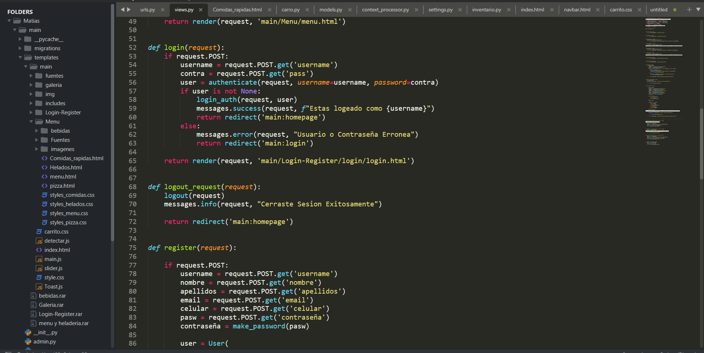
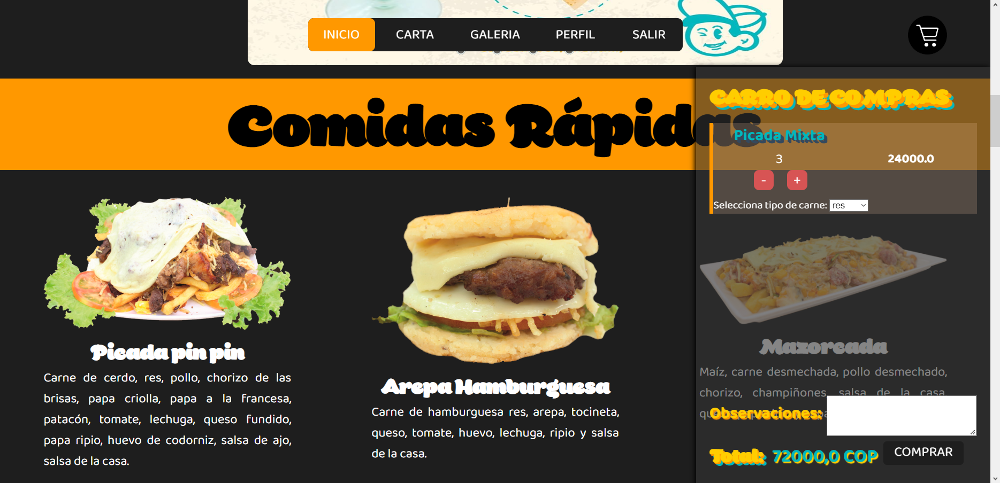

## Matias Pin Pin

     

Pagina web para un restaurante , para la funcionalidad de domicilios y pedidos de forma estrategica y funcional.

## Objetivo

La creación de un entorno web para mejorar la administración a la hora de tomar los pedidos y así se pueda organizar dichos pedidos, además se pueda dar a conocer más la franquicia de comidas rápidas Matias Pin Pin

## Desarrollo
Se creara una página web en la cual puedas registrarte y ver una variedad de productos del restaurante, productos los cuales tendrás su propia categoría cada uno, también dado la opción de agregarlos al carrito de compras para que puedas seleccionar y pedir de forma ordenada tus domicilios y al restaurante le quede mas sencillo poder ordenar y hacer los pedidos dependiendo de la hora y el lugar, además los clientes podrán ver la situación de su pedido en tiempo real y podrá chatear con el asesor del restaurante para saber el estatus de su encargo, por otro lado el asesor podrá establecer el tiempo aproximado de la llegada de los productos, de paso el cliente podrá ver la variedad de imágenes para que pueda saber el lugar y como es la estructura del restaurante y así pueda ir y recomendarlo con otras personas, ya que este es un lugar apto para toda la familia.

## Contributors

### Language

